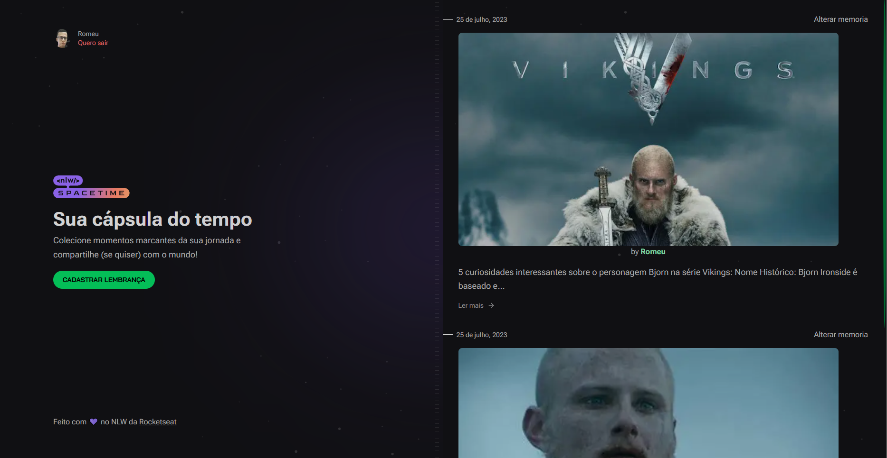
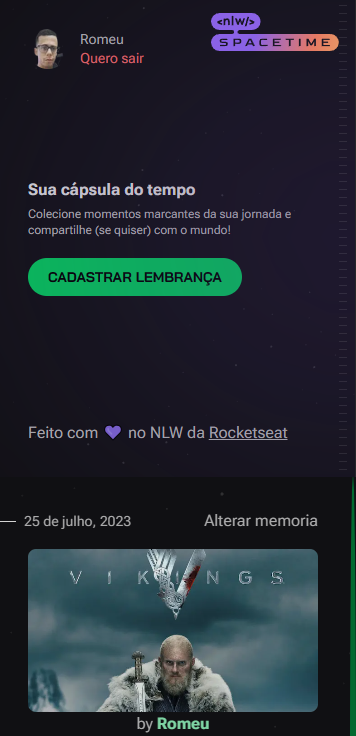

<h1 align='center'> Space Time </h1>

[Entre no Space Time](https://nlw-space-time-web-neon.vercel.app)

 

📃 Seja bem-vindo ao Space Time - O lugar perfeito para eternizar suas lembranças! Compartilhe momentos inesquecíveis através de uma única imagem e uma emocionante descrição que encapsule toda a magia da sua memória. Aqui, cada lembrança ganha vida e se torna uma história cativante. Junte-se a nós e descubra como é fácil e encantador guardar seus momentos mais preciosos em um único espaço!
Esta aplicação foi criado no evento da empresa em tecnologia <strong>Rocketseat</strong> e aprimorado por minha pessoa.

 

<h2> Também para Mobile </h2>

[Entre no Space Time](https://nlw-space-time-web-neon.vercel.app)

 

<h2> Recursos exclusivos do Space Time </h2>

- Compartilhe com Sentimento: Deixe sua criatividade fluir ao compartilhar suas memórias por meio de imagens e descrições envolventes. Conte a história por trás de cada momento especial e faça com que seus momentos durem para sempre.

- Privado ou Público: A escolha é sua! Você decide se deseja que suas lembranças sejam privadas ou públicas, permitindo que pessoas ao redor do mundo se conectem com suas histórias inspiradoras.

- Edição Simples: Aprimore suas lembranças com facilidade. O Space Time oferece a opção de editar suas imagens e descrições sempre que desejar, permitindo que você refine e melhore cada detalhe.

- Detalhes Cativantes: Veja suas memórias ganharem vida em uma visualização detalhada. Explore cada imagem em sua plenitude, proporcionando uma experiência imersiva e envolvente para quem a visita.

- Data e Autoria: Cada lembrança é acompanhada pela data de criação, para que você possa relembrar os momentos especiais que moldaram sua vida. Além disso, você verá o nome do autor, para uma conexão mais humana com cada história compartilhada.

- Autenticação Rápida: A entrada no Space Time é descomplicada e ágil! Utilize a autenticação via GitHub, o que torna o processo de login seguro, prático e sem complicações.

 

<h2> 🛠 Principais Tecnologias Utilizadas </h2>

Este projeto foi desenvolvido com as seguintes tecnologias:

- reactjs
- nextjs
- typescript
- tailwindcss

<h2> Como usar </h2>

Para utilizar o Space Time em sua máquina local, siga as instruções abaixo:

- Clone este repositório: git clone https://github.com/Romeusorionaet/Nlw-SpaceTime-Web.git
- Instale as dependências: npm install ou yarn install
- Inicie o servidor de desenvolvimento: npm run dev ou yarn dev
- Acesse a aplicação em seu navegador em: http://localhost:3000

 

Aprenda a utilizar a API de autenticação do GitHub em apenas alguns passos simples! Siga este guia para configurar sua aplicação de forma rápida e eficiente:

 

1: Acesse o <strong>Github</strong> e vá para o seu perfil. Em seguida, clique em <strong>Settings</strong> e, na parte inferior da página, clique em <strong>Developer Settings</strong>.

2: Agora, clique em <strong>oAuth Apps</strong> e selecione a opção <strong>New oAuth Apps</strong>.

3: No campo <strong>Application Name</strong>, dê um nome a sua aplicação.

4: Em <strong>Home Page URL</strong>, insira a URL da sua API.

5: Embora seja opcional, uma boa prática é preencher a <strong>Application Description</strong>, destacando os recursos e funcionalidades da sua aplicação.

6: Na seção <strong>Authorization callback URL</strong>, insira a URL da sua API, seguida da rota de autentificação. Por exemplo: "http://localhost:3000/api/auth/callback".

7: Ao salvar as configurações, o <strong>Github</strong> irá gerar seu <strong>Client ID</strong> exclusivo. Anote-o, pois será importante para a aplicação.

8: Em seguida, clique em <strong>Generate a new client secret</strong> para obter o <strong>client secret</strong>. Guarde-o com segurança, pois ele também é essencial para o funcionamento da sua aplicação.

Agora que você tem suas chaves de autenticação, preencha corretamente as variáveis de ambiente como mostrado no arquivo <strong>.env.example</strong>, seguindo o exemplo mostrado nesta aplicação frontend. Com as variáveis configuradas adequadamente, sua aplicação estará pronta para decolar!

Desfrute da integração com a API de autenticação do GitHub e crie experiências incríveis para os usuários da sua aplicação. Lembre-se de seguir as melhores práticas de segurança ao trabalhar com chaves de autenticação.

 

<h2> Backend </h2>

>Esta aplicação está utilizando a api https://github.com/Romeusorionaet/Api-Nlw-SpaceTime entre no repositório e siga os passos para a configuração

 

<h2 align='center'> Meus contatos </h2>

* [LinkedIn](https://www.linkedin.com/in/romeu-soares-87749a231/)

* romeuindexjs@gmail.com

* WhatsApp: 84 981127596

 

<h3> Autor </h3>

>Romeu soares de souto

<h3> Licença </h3>

